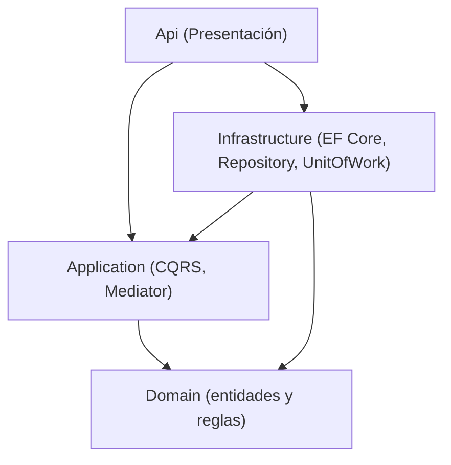

# Comunal – Catálogo

Microservicio de catálogo de objetos del proyecto **Comunal** (plataforma para que una comunidad
comparta y recupere objetos). Gestiona los objetos que los miembros ponen a disposición para préstamo.

Hecho en **.NET 8** con **Clean Architecture** y **DDD**, aplicando los patrones **CQRS, Mediator,
Repository y Unit of Work**. Persistencia en **SQL Server con EF Core**.

## Arquitectura

Cuatro capas con la regla de dependencia hacia el Dominio:



| Patrón | Dónde |
|---|---|
| CQRS | `Application/Objetos/Commands` y `Application/Objetos/Queries` |
| Mediator | MediatR; el controlador solo hace `ISender.Send(...)` |
| Repository | `IObjetoRepository` → `Infrastructure/Persistence/Repositories` |
| Unit of Work | `IUnitOfWork` → `Infrastructure/Persistence/UnitOfWork` |

## Requisitos

- .NET SDK 8.0
- SQL Server LocalDB (incluido con Visual Studio) u otra instancia de SQL Server

## Ejecutar

```bash
dotnet run --project src/Comunal.Catalogo.Api --launch-profile https
```

Al iniciar se crea la base de datos y se cargan los datos de ejemplo. La documentación de la API
queda en Swagger: `https://localhost:7090/swagger`. La cadena de conexión está en
`src/Comunal.Catalogo.Api/appsettings.json`.

## Endpoints

| Método | Ruta | Descripción |
|--------|------|-------------|
| GET | `/api/objetos` | Lista los objetos |
| GET | `/api/objetos/{id}` | Detalle de un objeto |
| GET | `/api/objetos/categoria/{categoriaId}` | Objetos de una categoría |
| POST | `/api/objetos` | Publica un objeto |
| PUT | `/api/objetos/{id}` | Actualiza un objeto |
| DELETE | `/api/objetos/{id}` | Retira un objeto |

Las reglas de dominio se validan en la entidad y se devuelven como `400`. Por ejemplo, al publicar
un objeto sin nombre:

```json
{ "status": 400, "error": "Regla de negocio no cumplida", "message": "El nombre del objeto es requerido." }
```

## Integrantes

- Sara Arciniegas Villa
- Juan Pablo Robledo Urrego
- Juan Pablo Vásquez Tobón
- Alexander Sanmartín Arredondo
