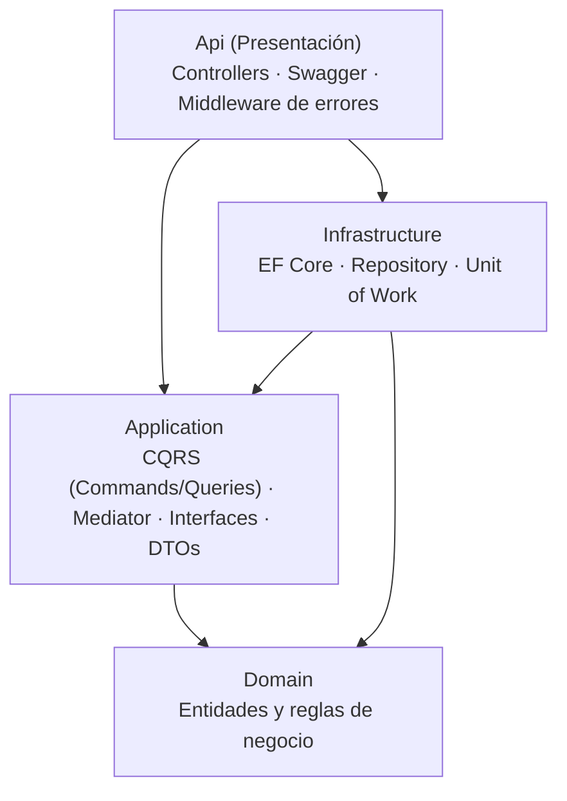

# Comunal – Catálogo

Microservicio de **catálogo de objetos** del proyecto Comunal, una plataforma para que una
comunidad (un edificio, un barrio, la universidad) comparta y recupere objetos. Este servicio
gestiona los objetos que los miembros ponen a disposición para préstamo.

Está construido con **.NET 8** aplicando **Clean Architecture** y **Domain-Driven Design (DDD)**,
y usando los patrones **CQRS, Mediator, Repository y Unit of Work**. La persistencia es
**SQL Server con Entity Framework Core**.

## Arquitectura

La solución se divide en cuatro capas con la regla de dependencia hacia adentro (todo apunta al
Dominio, que es el núcleo y no depende de nada):



- **Domain:** la entidad `Objeto` (raíz de agregado) y `Categoria`. Aquí viven todas las reglas
  de negocio; no se puede construir ni mutar un objeto en un estado inválido.
- **Application:** los casos de uso separados en *Commands* (escritura) y *Queries* (lectura)
  con **MediatR**, más las interfaces de `IObjetoRepository`, `ICategoriaRepository` e `IUnitOfWork`.
- **Infrastructure:** el `CatalogoDbContext`, las configuraciones de EF Core y la implementación
  de los repositorios y la Unit of Work.
- **Api:** los endpoints REST, Swagger y un middleware que traduce las excepciones de dominio a
  respuestas HTTP.

### Dónde está cada patrón

| Patrón | Dónde |
|---|---|
| **CQRS** | `Application/Objetos/Commands` y `Application/Objetos/Queries` |
| **Mediator** | MediatR; el controlador solo hace `ISender.Send(...)` |
| **Repository** | `IObjetoRepository` / `ICategoriaRepository` → `Infrastructure/Persistence/Repositories` |
| **Unit of Work** | `IUnitOfWork` → `Infrastructure/Persistence/UnitOfWork` |

## Estructura

```
src/
├── Comunal.Catalogo.Domain          # Entidades, enums, excepciones de dominio
├── Comunal.Catalogo.Application      # Commands, Queries, Handlers, DTOs, interfaces
├── Comunal.Catalogo.Infrastructure   # DbContext, configuraciones, repositorios, UnitOfWork, migraciones
└── Comunal.Catalogo.Api              # Controllers, Middleware, Program.cs, Swagger
```

## Requisitos

- .NET SDK **8.0**
- SQL Server **LocalDB** (viene con Visual Studio) o cualquier instancia de SQL Server
- Opcional (para crear migraciones): `dotnet tool install --global dotnet-ef`

## Cómo ejecutar

1. Clonar el repositorio.
2. Ejecutar la API:
   ```bash
   dotnet run --project src/Comunal.Catalogo.Api --launch-profile https
   ```
   Al iniciar, la aplicación aplica la migración, crea la base de datos y carga los datos de
   ejemplo automáticamente.
3. Abrir Swagger en `https://localhost:7090/swagger`.

La cadena de conexión está en `src/Comunal.Catalogo.Api/appsettings.json` y por defecto usa
LocalDB. Si usas otra instancia, cámbiala ahí.

## Endpoints

| Método | Ruta | Descripción |
|--------|------|-------------|
| GET | `/api/objetos` | Lista todos los objetos |
| GET | `/api/objetos/{id}` | Detalle de un objeto |
| GET | `/api/objetos/categoria/{categoriaId}` | Objetos de una categoría |
| POST | `/api/objetos` | Publica un objeto |
| PUT | `/api/objetos/{id}` | Actualiza un objeto |
| DELETE | `/api/objetos/{id}` | Retira un objeto (baja lógica) |

En la carpeta `docs/` está la colección de Postman (`Comunal.Catalogo.postman_collection.json`)
con ejemplos de peticiones exitosas y de errores de validación.

### Ejemplo de petición exitosa

`POST /api/objetos`
```json
{
  "nombre": "Escalera de aluminio",
  "descripcion": "Escalera de 5 pasos, plegable.",
  "categoriaId": 1,
  "propietarioId": "22222222-2222-2222-2222-222222222222"
}
```
Respuesta `201 Created`.

### Ejemplo de error de validación de dominio

`POST /api/objetos` con el nombre vacío:
```json
{ "nombre": "", "descripcion": "Algo", "categoriaId": 1, "propietarioId": "22222222-2222-2222-2222-222222222222" }
```
Respuesta `400 Bad Request`:
```json
{ "status": 400, "error": "Regla de negocio no cumplida", "message": "El nombre del objeto es requerido." }
```

## Datos de ejemplo

Se siembran 5 categorías (Herramientas, Hogar, Electrónica, Libros, Deportes) y 5 objetos.

## Integrantes

- Sara Arciniegas Villa
- Juan Pablo Robledo Urrego
- Juan Pablo Vásquez Tobón
- Alexander Sanmartín Arredondo
